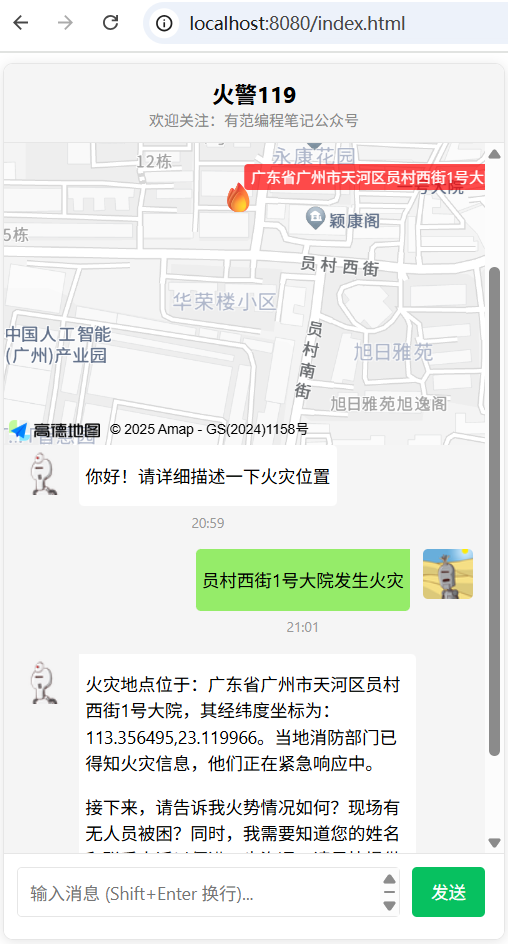
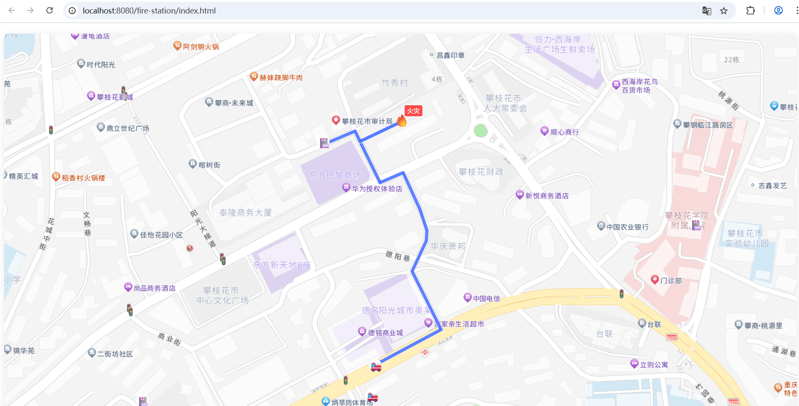

# amap-mcp-119
## 火警应急系统

## 快速开始
* 1、执行初始化db/init.sql 
* 2、修改配置  
2.1 阿里云百炼：OPEN_API_KEY  
2.2 数据库密码  
````
spring.ai.openai.base-url=https://dashscope.aliyuncs.com/compatible-mode/
spring.ai.openai.chat.options.model=deepseek-r1
spring.ai.openai.api-key=${OPEN_API_KEY}
spring.ai.mcp.client.stdio.servers-configuration=classpath:/mcp-servers-config.json
amap.key=${AMAP_API_KEY}

spring.datasource.url=jdbc:mysql://${MYSQL_HOST_PORT}/fire-test?useSSL=false&verifyServerCertificate=false&allowPublicKeyRetrieval=true&characterEncoding=utf8&characterSetResults=utf8&autoReconnect=true&failOverReadOnly=false&serverTimezone=GMT%2B8
spring.datasource.username=root
spring.datasource.password=${MYSQL_PASSWORD}
````
2.3 修改高德地图api key  
````
{
    "mcpServers": {
        "amap-maps": {
            "command": "npx.cmd", 
            "args": [
                "-y",
                "@amap/amap-maps-mcp-server"
            ],
            "env": {
                "AMAP_MAPS_API_KEY": "高德地图API Key"
            }
        }
    }
}
````
* 2、直接启动AmapMcp119Application  
### 119 报警智能助手
* 访问地址:http://localhost:8080/index.html
  

### 消防队相应系统
* 访问地址:http://localhost:8080/fire-station/index.html
  
## 问题讨论
在下面的微信公众号提交问题，有时间一起交流学习。更多资料关注公众号【有范编程笔记】


